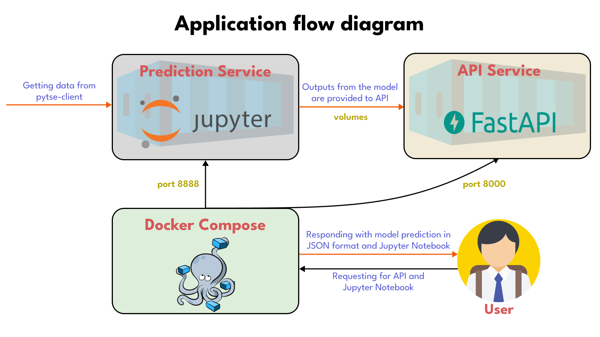

# InsightiFi 


---
**InsightiFi** is a continuation of [Hamtech](https://ham-tech.ir/)'s internship program. [Alireza](https://github.com/AlirezaHanifi), [Mahdi](https://github.com/mahdi-mhdn), [Mohmmad](https://github.com/moshafieeha), and [Shabnam](https://github.com/ShabnamGhadiri) were members of that group with [Masoud](https://github.com/masoudMZB) as a mentor.

- [About InsightiFi](##About_InsightiFi)
- [How to Use?](##How_to_Use?)
  - [With docker](###With_docker)
  - [Without docker](###Without_docker)
- [Wiki Page](##Wiki_Page)
- [Dataset](##Dataset)
- [ToDo](##ToDo)
- [Contribute](##Contribute)

## About InsightiFi
This is a tool for traders to help them decide to buy/sell/hold, or for ML engineers who want to make their hands dirty in working with Time series/Economical data.
To make better predictions, been used the following indicators and features:
- **Trend Indicator**: Exponential Moving Average (EMA), Ichimoku Kinkō Hyō (Ichimoku), Simple Moving Average (SMA), Moving Average Convergence Divergence (MACD).
- **Momentum Indicator**: Relative Strength Index (RSI), Stochastic Oscillator (SR).
- **Volatility Indicator**: Bollinger Bands (BB).
- **Other Features**: Calendar, Candlestick, Individual and Non-Individual Trades, Price Based Ratios, Daily Return (DR), Daily Logarithmic Return (DLR),  Weighted Values.

This project comprises two separate yet interconnected services, namely the prediction service and the API service, which are linked through a docker-compose.</br>
The prediction service is responsible for retrieving daily data, conducting model training, and producing output predictions. A cron job is executed each day to execute this service. Additionally, the prediction service provides users with the option of accessing a Jupyter Notebook environment to gain a better understanding of the model's performance.</br>
The API service, built using the FastAPI library, serves as a means for users to access the predicted model's output. Specifically, the API service retrieves the latest forecast of the day, which is stored in a shared volume by the prediction service and delivers it to the user. This allows for easy access to the predicted results for end-users.



## How to Use?

### With docker
1. Clone the project:
```command
git clone https://github.com/Hamtech-ai/iran-stock-market
```
2. Build and run application in the background.
```command
docker-compose up --build -d
```
  - up will start the whole application.
  - --build will first build the application before starting it.
  - -d will run the application in the background.

### Without docker
1. Clone the project:
```command
git clone https://github.com/Hamtech-ai/InsightiFi.git
cd InsightiFi
```

## Wiki Page
To check complete Documentation for all steps check our [wiki page](https://github.com/Hamtech-ai/iran-stock-market/wiki) or our [Google Docs](https://docs.google.com/document/d/1NbIWJfHzW-8RMb3ehISZkVnc9NT_eC4ANTSgOyonVdQ/edit?usp=sharing). (In progress...)


## Dataset
We utilized stock price data as well as the TEDPIX index from the Tehran Stock Exchange. After careful consideration, we determined that the [pytse-client](https://github.com/Glyphack/pytse-client) library was the most suitable source of financial features for the following reasons:
1. The pytse-client library is an open-source and efficient library that provides us with fast access to financial data.
2. The library's data is continuously updated on a daily basis, which ensures that we have access to the most recent information.
3. The pytse-client library contains valuable data about individual sales and purchases, which is important for identifying market trends and making informed investment decisions.
4. The library also provides historical data, enabling us to analyze buying patterns and stock performance over extended periods of time.


## ToDo
- [x] ~~Deployment with docker containers.~~
- [ ] Using a cron job to run the model daily.
- [ ] Improved visualization of indicators and model performance, and rewritten Jupyter Notebook.
- [ ] Using more indicators, to gain more insight into daily price data.
- [ ] Using NLP tools to enhance accuracy of model in daily predictions.


## Contribute
Before opening a [PR](https://github.com/Hamtech-ai/iran-stock-market/pulls), please read our [contributor](CONTRIBUTING.md) guide. This project exists thanks to all the people who contribute:
<p align="center"><a href="https://github.com/Hamtech-ai/InsightiFi/graphs/contributors">
  
</a></p>