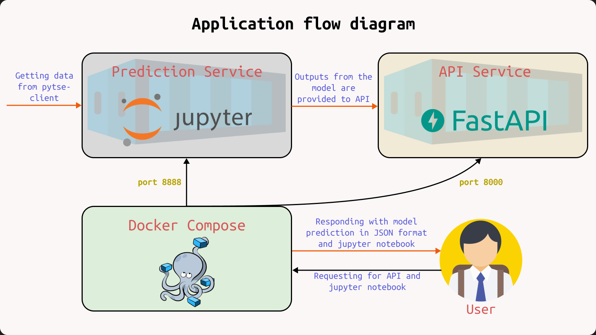

# About this project
This is a tool for traders to help them decide to buy/sell/hold, or for ML engineers who want to make their hands dirty in working with Time series/Economical data.
To make better predictions, been used the following indicators and features:
- **Trend Indicator**: Exponential Moving Average (EMA), Simple Moving Average (SMA), Moving Average Convergence Divergence (MACD).
- **Momentum Indicator**: Relative Strength Index (RSI), Stochastic Oscillator (SR).
- **Volatility Indicator**: Bollinger Bands (BB).
- **Other Features**: Calendar, Candlestick, Individual and Non-Individual Trades, Price Based Ratios, Daily Return (DR), Daily Logarithmic Return (DLR), Cumulative Return (CR).

A two-class classification has been considered to be the best approach to the project. Data is labeled using the **zigzag** indicator. The days where the slope of the zigzag line is positive, all those trading days are considered to be buy positions (+1). In contrast, when the slope is negative, all those trading days are considered to be sell positions (-1). **Random forests** are currently being used as the model and the hyperparameters of the model are optimized by using the **Bayesian** method. 

An API is available to access the model's output, which is a probability between zero and one on all trading days. This application is dockerized, and its flow diagram is as follows:


# How to Use
1. Clone the project:
```command
git clone https://github.com/Hamtech-ai/iran-stock-market
```
2. Build and run application in the background.
```command
docker-compose up --build -d
```
  - up will start the whole application.
  - --build will first build the application before starting it.
  - -d will run the application in the background.

# Wiki Page
To check complete Documentation for all steps, check our [wiki page](https://github.com/Hamtech-ai/iran-stock-market/wiki).

# Dataset
The following three primary reasons led us to choose [pytse-client](https://github.com/Glyphack/pytse-client) library as our ML dataset of the Iranian stock market:
1. Data is updated daily and non-stop.
2. Contains valuable data about individual sales and purchases.
3. Has a history of buying stocks over long periods.

# TODO
- [ ] Using a cron job to run the model daily.
- [ ] Improved visualization of indicators and model performance, and rewritten Jupyter Notebook.
- [ ] Deployment With Docker Containers.
- [ ] Using more indicators, such as Ichimoku, to gain more insight into daily price data.
- [ ] Using NLP tools to enhance accuracy of model in daily predictions.

# Contribute
Before opening a [PR](https://github.com/Hamtech-ai/iran-stock-market/pulls), please read our [contributor](/.github/CONTRIBUTING.md) guide. This project exists thanks to all the people who contribute:
<p align="center"><a href="./graphs/contributors">
  
</a></p>